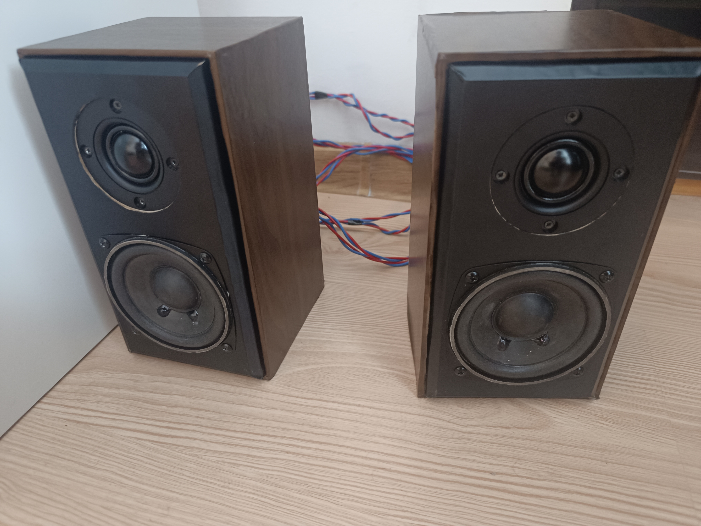
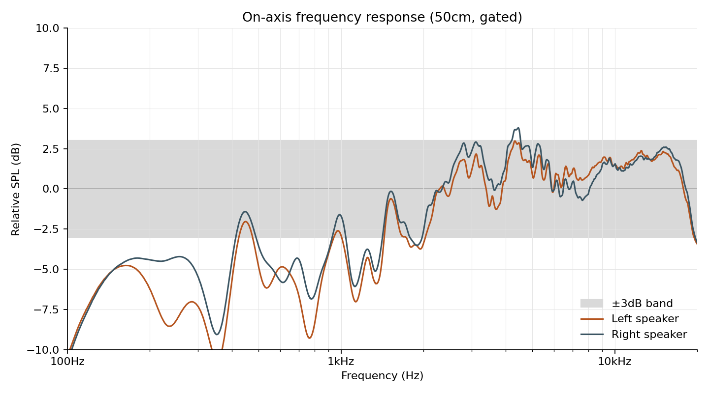
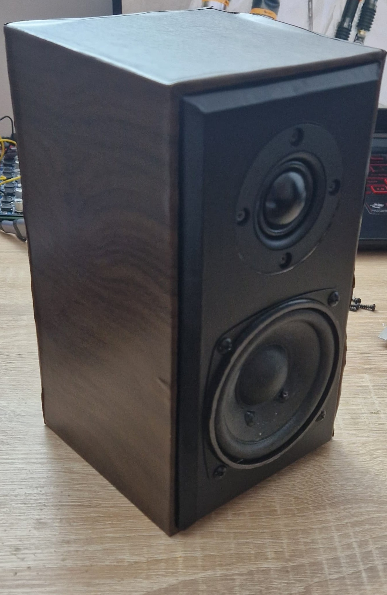
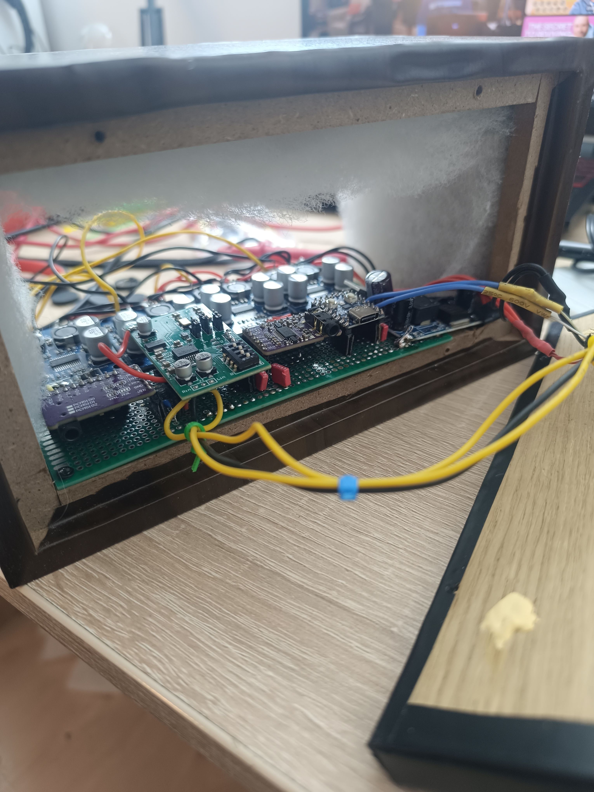

# DSPeaker

A DIY 2-way active desktop monitor: custom cabinets, an RP2040 running a hand-written fixed-point DSP crossover, and independent DACs giving each speaker its own full crossover network. Every DSP decision here was validated against real acoustic measurement, not tuned by ear.

<p align="center">
  
</p>

## Measured Result



Gated 50cm on-axis, both speakers, raw/unsmoothed standard deviation **±2.65dB (Left) / ±2.47dB (Right)** across 100Hz–20kHz.

---

## Hardware

| | |
|---|---|
| **Tweeter** | Dayton Audio ND25FA-4 — 25mm silk dome, 4Ω, Re 3.2Ω, Fs 1350Hz, Qts 1.56, Sd 7.5cm², 90dB @ 2.83V/1m, 20W RMS, manufacturer usable range 2.5–20kHz (full manufacturer datasheet not redistributed here — search "Dayton Audio ND25FA-4" on their site for the original PDF) |
| **Woofer** | Unmarked ~75mm cone driver, Thiele-Small parameters measured directly — see [`driver_measurements`](driver_measurements): Re 5.50–5.57Ω, Fs 128.6–132.5Hz, Qts 1.702–1.858, Vas 0.92L, Sd 44.2cm², ≈81dB @ 1W/1m |
| **Amplification** | TPA3118D2 Class-D, 4 channels total (one per driver — tweeter and woofer never share a channel), run at 12V against a 24V/≈60W rating |
| **DSP** | Raspberry Pi RP2040 (Waveshare RP2040-Zero), no hardware FPU, 48kHz, fixed-point (Q28/Q31) |
| **Converters** | WM8782 ADC (stereo input), 2× PCM5102A DAC — one per speaker, each independently addressed, not a stereo pair sharing one chip |
| **Cabinet** | CNC-cut baffle/frame, front baffle 110×210mm, internal acoustic stuffing |

No standalone schematic exists for the electronics — the actual signal chain is fully specified in the pin-level comments at the top of [`miXZer.c`](firmware/miXZer/miXZer.c), and the real build is visible in the photos below. The perfboard carries the WM8782 ADC input stage, the RP2040-Zero, and the two PCM5102A DAC modules feeding the four TPA3118 amp channels.

<p align="center">
  
  
</p>

---

## Firmware & DSP

All of it lives in [`miXZer.c`](firmware/miXZer/miXZer.c) — one file, no RTOS, an interrupt-driven double-buffered DMA pipeline running the whole signal chain sample-by-sample in real time.

**Signal path:**
```
ADC (WM8782, stereo in)
      │
      ▼
 Baffle-step shelf (source L/R, pre-split)
      │
      ├──► Tweeter HPF (LR4, 3kHz) ──► amp1 (L) / amp3 (R)
      │
      └──► Woofer LPF (LR4, 3kHz) ──► level pad ──► amp2 (L) / amp4 (R)
```

Left and Right stay fully independent the entire way through — two DACs, two crossovers, never mixed.

**Fixed-point throughout.** The RP2040 has no hardware FPU — a float multiply costs ~80 cycles in software, not viable inside a 48kHz real-time budget. Filters run in Q0.31 where coefficients stay under 1.0, Q3.28 where they don't (the crossover biquads exceed ±1.0), multiplies widened to 64-bit before rescaling to avoid overflow.

**The crossover went through three real iterations:**
1. Two cascaded 1st-order HPF/LPF stages (LR2-equivalent) — a real destructive-interference notch showed up at 1.5–2.2kHz. A delay line made it worse in both directions. Root cause: LR2 only sums flat with one driver's polarity inverted.
2. With that fixed, the tweeter's own mechanical resonance (Fs=1350Hz, Qts 1.56) was only getting ~16dB of attenuation from the 2-pole HPF — audible as a +8–10dB peak at 1.4kHz. Bumping the tweeter HPF to 3 stages fixed the resonance but broke the matched-order flat-sum property, reopening a different ~9–10dB dip.
3. **Final: a real 4th-order Linkwitz-Riley (LR4)** — two cascaded 2nd-order Butterworth biquads per side, matched order, normal (non-inverted) polarity. Steeper than the 3-pole hack (−28.4dB at the tweeter's resonance, vs −24.1dB) *and* matched-order, so it sums flat on its own — verified flat to <1e-13dB across 500Hz–6kHz in the design math. The coefficient design tool is at [`design_tools/test_lr4_crossover.py`](firmware/miXZer/design_tools/test_lr4_crossover.py).

**Baffle-step compensation**: the 110mm baffle width gives a shelf corner at `115/0.11m ≈ 1045Hz`. A +4dB low shelf below that, applied pre-crossover-split, compensates for the cabinet losing half-space loading at low frequencies.

**Level matching**: no tweeter pad survived — estimated values gave wildly inconsistent results session to session, traced to measurement setup rather than the electronics. With no pad at all, a clean measurement showed the woofer running 4.36dB hot; the woofer gets that attenuation instead.

**Live diagnostics over USB serial**, no reflashing between measurement takes: `b`/`t`/`w` for both/tweeter-only/woofer-only, `s` to toggle the baffle-step shelf. A separate firmware, [`channel_id.c`](firmware/miXZer/channel_id.c), confirmed the amp-to-driver mapping by playing a distinct tone per channel: **amp1 = Left tweeter, amp2 = Left woofer, amp3 = Right tweeter, amp4 = Right woofer.**

---

## The Stereo-Imaging Bug

The single most important fix in the project, and it was silent — nothing sounded obviously broken. The original design treated the I2S Left/Right *slot* as meaning tweeter/woofer, and fed the second DAC as a literal mirror of the first. Source-Left reached *both* tweeters, source-Right reached *both* woofers — true stereo imaging was scrambled the whole time. Fixed by splitting each speaker's own source channel into its own tweeter/woofer feed, with the second DAC's buffer filled independently every sample instead of mirrored.

---

## Repository Structure

```
firmware/
├── miXZer/        Current firmware — miXZer.c (main DSP), channel_id.c
│                   (driver-identification tool), lib/ (PIO I2S driver),
│                   design_tools/ (LR4 coefficient calculator)
└── build_tools/    auto_flash_rp2040.py — the UF2 flashing script actually used

driver_measurements/   Measured Thiele-Small parameters for both woofers

images/                 Build photos and the measured frequency response chart
```

---

## Building It Yourself

**Toolchain** (not vendored here — install yourself, pinned to what this was built/tested with):
- `arm-none-eabi-gcc` 14.2.1 (Release)
- CMake 3.29+
- Ninja
- [Raspberry Pi Pico SDK](https://github.com/raspberrypi/pico-sdk) 2.2.0

**Build:**
```
cd firmware/miXZer
python build_mixzer.py
```

**Flash** (board in BOOTSEL mode):
```
cd firmware/build_tools
python auto_flash_rp2040.py
```

By default this flashes `miXZer.uf2`; pass an explicit path as the first argument to flash something else (e.g. `channel_id.uf2`).
